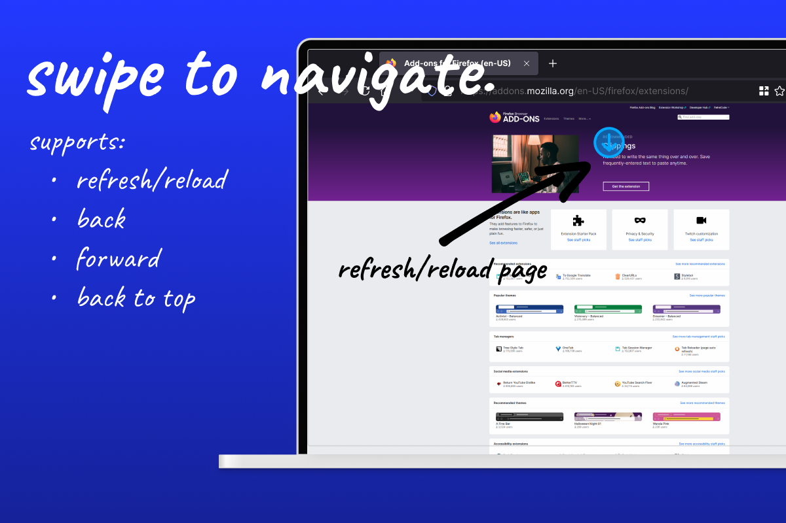
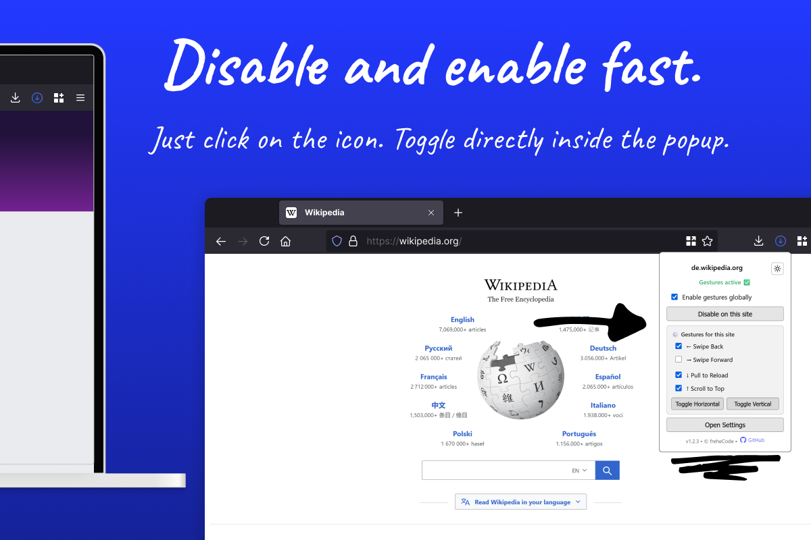
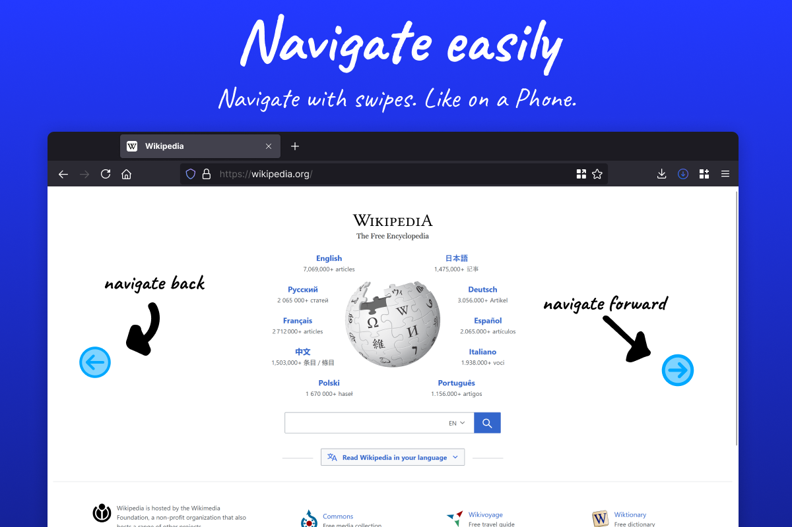
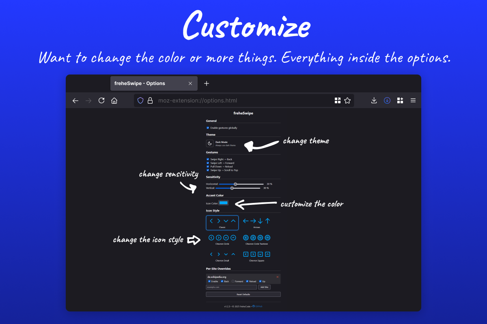

# 🖐️ Touchscreen Swipe Navigation — *freheSwipe*

freheSwipe brings effortless, phone‑like **touchscreen gestures** to desktop browsers.  
Swipe **left**, **right**, or **down** to navigate **Back**, **Forward**, or **Reload** — right where your finger already is.

---

## 📚 Table of Contents

- [Features](#-features)
- [Screenshots](#-screenshots)
- [Installation](#-installation)
- [Quick Start](#-quick-start)
- [Privacy](#-privacy)
- [Issues & Support](#-issues--support)
- [License](#-license)
- [Third‑party Licenses & Attributions](#-thirdparty-licenses--attributions)

---

## ✨ Features

- 🔹 **Back / Forward** — one‑finger horizontal swipes  
- 🔹 **Pull‑Down Reload** — drag downward from the top to refresh  
- 🔹 **Adjustable Sensitivity** — tune swipe distance to your liking  
- 🔹 **Per‑Site Control** — allow or disable gestures by site or direction  
- 🔹 **Quick Toggle Popup** — instantly disable gestures for the current page  
- 🔹 **Full Options Page** — configure everything in a clean, intuitive UI  

## 📸 Screenshots

### Extension in Action

  
  
  

  
  

---

## 🧩 Installation

### 🦊 Firefox (Add‑ons Store)
1. Visit **[freheSwipe on AMO](https://addons.mozilla.org/en-US/firefox/addon/freheswipe/)**.  
2. Click **Add to Firefox**, then confirm.  
3. The extension icon will appear automatically in the toolbar.

### 🌐 Chrome / Edge (Web Store)
1. Visit **[freheSwipe on Chrome Web Store](https://chromewebstore.google.com/)** (coming soon).  
2. Click **Add to Chrome** - works in Chromium‑based browsers (Edge, Brave, etc.).  
3. Pin the icon if you want quick access.

---

## 🚀 Quick Start

1. Install the extension.  
2. Visit any website.  
3. Swipe → **Right = Back · Left = Forward · Down = Reload**.  

That’s it—smooth, intuitive navigation on any touchscreen‑enabled desktop browser.

---

## 🔒 Privacy

- ✅ **Zero tracking** — all gestures are processed locally.  
- ⚠️ Future versions *may* collect anonymous usage metrics (e.g., install counts, feature usage).  
- 🪪 Any data collection will always be **opt‑in** and transparently disclosed in release notes.

---

## 🐛 Issues & Support

Found a bug or have a suggestion?  
👉 Open an issue here: **[github.com/freheCode/freheSwipe/issues](https://github.com/freheCode/freheSwipe/issues)**

Please include:  
- Browser + version  
- Steps to reproduce  
- Expected vs actual behavior  

---

## 📄 License

**GNU General Public License v3.0** — Free and Open‑Source Software  

This project is licensed under the **GNU General Public License v3.0**.

**What this means**

- ✅ Use freely — personal & commercial use allowed  
- ✅ Modify freely — adapt and improve as you wish  
- ✅ Share freely — distribute original or modified versions  
- ⚠️ Share alike — derivatives must remain GPL‑3.0  
- ⚠️ Disclose source — make source code available when distributing  
- ✅ Protected — cannot be closed or relicensed proprietarily

© 2025 freheCode — see [LICENSE](LICENSE.txt) for full license text.

---

## 📦 Third‑party Licenses & Attributions

This project uses icons from the open‑source  
**[Material Line Icons](https://github.com/cyberalien/line-md)** set distributed via [Iconify](https://iconify.design/),  
licensed under the **MIT License**.

All third‑party artwork retains its original license; see  
[THIRD_PARTY_LICENSES.md](THIRD_PARTY_LICENSES.md) for full details.

All other code and assets are © 2025 freheCode and licensed under  
the **GNU General Public License v3.0 or later**.